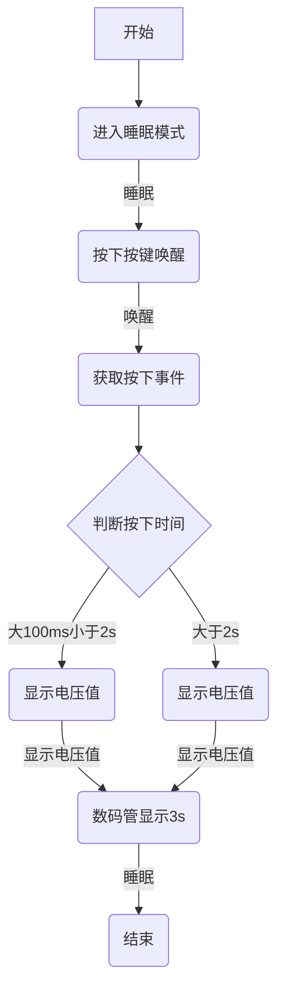

### 1、项目功能介绍

1. 按键短按（大于100ms小于200ms），数码管显示温湿度
2. 按键长按（大于2s），数码管显示电池电压

### 2、项目属性

> #第九届立创电赛#温湿度检测仪

###  3、开源协议

Public Domain协议

### 4、硬件部分

### 5、软件部分

```mermaid
graph TD;
    start[开始] --> A(进入睡眠模式);
    A -->|睡眠| B(按下按键唤醒);
    B -->|唤醒| C(获取按下事件);
    C --> E{判断按下时间};
    E -->|大100ms小于2s| F(显示电压值);
    F -->|显示电压值| G(结束);
    E -->|大于2s| D(显示电压值);
    D -->|显示电压值| G(数码管显示3s);
    G -->|睡眠| H(结束)

```

